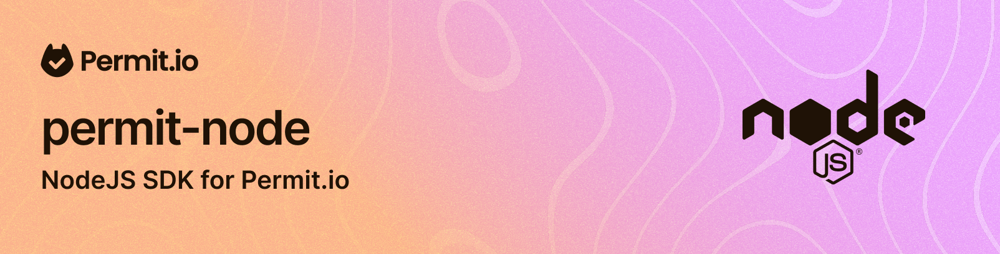

# Permit.io client for Node.js

Node.js client library for the Permit.io full-stack permissions platform.

## Installation

```
npm install permitio
```

## Release

1. Update the version in `package.json`
2. Execute `yarn run build`
3. Execute `yarn docs ; git add docs/ ; git commit -m "update tsdoc"` to update the auto generated docs
4. Execute `yarn publish --access public`

## Retry Configuration

The SDK includes built-in retry support for transient failures. Retries are **opt-in**:
they are **off** unless you pass a `retry` config (or `retry: { enabled: true }`).

When enabled, the defaults are:

- **3 retry attempts** with exponential backoff
- Retries on network errors and status codes: `408`, `429`, `500`, `502`, `503`, `504`
- Respects `Retry-After` headers for rate limiting (429)

> **Behavioral note**
>
> - Retries are opt-in — providing a `retry` config object turns them on; omitting it (or passing `retry: false`) leaves them off.
> - When enabled, PDP/OPA calls additionally retry `POST` because check operations are idempotent. The REST API does **not** retry `POST`, so non-idempotent writes are never repeated.

### Customizing Retry Behavior

```typescript
import { Permit } from 'permitio';

// Retries are off by default (opt-in)
const permitDefault = new Permit({ token: 'your-api-key' });

// Enable with custom retry configuration
const permitCustom = new Permit({
  token: 'your-api-key',
  retry: {
    maxRetries: 5,
    retryDelay: 500,        // Initial delay in ms
    backoffMultiplier: 2,   // Exponential backoff multiplier
    maxDelay: 30000,        // Maximum delay cap
  },
});

// Explicitly disable retry
const permitNoRetry = new Permit({
  token: 'your-api-key',
  retry: false,
});

// Different config for PDP vs REST API
const permitPdp = new Permit({
  token: 'your-api-key',
  retry: { maxRetries: 3 },
  pdpRetry: { maxRetries: 5 },
});
```

## Documentation

[Read the documentation at Permit.io website](https://docs.permit.io/sdk/nodejs/quickstart-nodejs#add-the-sdk-to-your-js-code)

## API Reference

[Check out the tsdoc reference here.](https://permitio.github.io/permit-node/classes/Permit.html)
