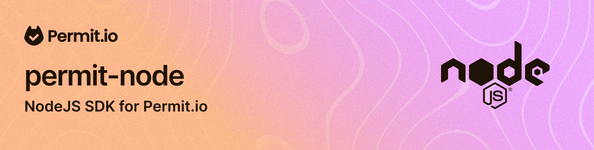

# Permit.io client for Node.js

Node.js client library for the Permit.io full-stack permissions platform.

## Supported runtimes

Node.js 22.13.0 or newer in the 22.x line, and Node.js 24.x are supported.
CI tests the minimum versions, 22.13.0 and 24.0.0. The package provides both
CommonJS (`require`) and ES module (`import`) entry points.

## Installation

```
npm install permitio
```

## Development

Use the Node version in `.nvmrc` and pnpm 12.8.1, pinned in `package.json`.
Install pnpm with `npm install --global --ignore-scripts pnpm@12.8.1`. Then run:

```sh
pnpm audit --audit-level=moderate
pnpm install --frozen-lockfile
pnpm build
pnpm lint
pnpm test
pnpm test:codegen
```

Installs disable lifecycle scripts, so builds and hook setup are explicit. To enable the
existing Git hook locally, run `pnpm exec husky install`. New dependency versions must be
at least 24 hours old; direct dependencies are saved with exact versions.

`pnpm test` runs the unit and module-import suites without a Permit backend.
`pnpm test:codegen` tests the generator guard without Java; `pnpm check:codegen` also
regenerates the fixture and requires Java.

## Release

1. Update the version in `package.json`
2. Execute `pnpm run build`
3. Execute `pnpm docs ; git add docs/ ; git commit -m "update tsdoc"` to update the auto generated docs
4. Execute `pnpm publish --access public`

## Retry Configuration

The SDK includes built-in retry support for transient failures. Retries are **opt-in**:
they are **off** unless you pass a `retry` config (or `retry: { enabled: true }`).

When enabled, the defaults are:

- **3 retries** (up to 4 total attempts) with exponential backoff
- Retries on network errors and status codes: `408`, `429`, `500`, `502`, `503`, `504`
- Respects `Retry-After` headers for rate limiting (429)

`maxRetries` is the number of retries _after_ the initial request, so the default of `3` means up to 4 total requests.

> **Behavioral note**
>
> - Retries are opt-in — providing a `retry` config object turns them on; omitting it (or passing `retry: false`) leaves them off.
> - When enabled, PDP/OPA calls additionally retry `POST` because check operations are idempotent. The REST API does **not** retry `POST`, so non-idempotent writes are never repeated.
> - A custom `axiosInstance` applies to the REST API only; PDP and OPA calls use dedicated internal axios instances.

### Customizing Retry Behavior

```typescript
import { Permit } from 'permitio';

// Retries are off by default (opt-in)
const permitDefault = new Permit({ token: 'your-api-key' });

// Enable with custom retry configuration
const permitCustom = new Permit({
  token: 'your-api-key',
  retry: {
    maxRetries: 5,
    retryDelay: 500,        // Initial delay in ms
    backoffMultiplier: 2,   // Exponential backoff multiplier
    maxDelay: 30000,        // Maximum delay cap
  },
});

// Explicitly disable retry
const permitNoRetry = new Permit({
  token: 'your-api-key',
  retry: false,
});

// Different config for PDP vs REST API
const permitPdp = new Permit({
  token: 'your-api-key',
  retry: { maxRetries: 3 },
  pdpRetry: { maxRetries: 5 },
});
```

## Logging and errors

`log.level` controls the SDK's log level (default: `warn`). Set it to `debug` to include HTTP
request and response diagnostics, or `silent` to disable SDK logs. `PERMIT_LOG_LEVEL` supplies
the default when `log.level` is omitted.

Logs are JSON lines by default. Set `log.json: false` for pretty text. When `log.json` is
omitted, `PERMIT_LOG_JSON` supplies the default: `false` selects pretty text, while `true`, an
unset variable, or any other value keeps JSON lines. The variable ignores letter case and
surrounding whitespace. An explicit `log.json` setting always overrides the environment variable.
Pretty output uses an in-process stream without worker threads. SDK initialization logs do not
include the API key or serialized configuration.

```typescript
import { Permit } from 'permitio';

const permit = new Permit({
  token: process.env.PERMIT_API_KEY,
  log: { level: 'debug', json: false },
});
```

With the default `throwOnError: true`, a PDP response with an unexpected status code, or a `200`
response with a body the SDK cannot read, throws `PermitPDPStatusError`, a subclass of
`PermitConnectionError`. It carries the HTTP `statusCode` and `responseBody`, the raw body the
PDP returned (parsed JSON, or text when the body is not JSON). Transport failures, such as
refused connections or timeouts, throw `PermitConnectionError`. Match errors with `instanceof`,
not their `name` or message, and check the more specific status error first:

```typescript
import { PermitConnectionError, PermitPDPStatusError } from 'permitio';

try {
  await permit.check('user-1', 'read', 'document:one');
} catch (error) {
  if (error instanceof PermitPDPStatusError) {
    console.error('PDP HTTP status:', error.statusCode);
  } else if (error instanceof PermitConnectionError) {
    console.error('PDP connection failed');
  } else {
    throw error;
  }
}
```

These rules apply to `check`, `bulkCheck`, `getUserPermissions`, and `checkAllTenants`.
With `throwOnError: false`, failures, including an invalid resource string, return `false` for
`check`, one `false` per input for `bulkCheck`, `{}` for `getUserPermissions`, and `[]` for
`checkAllTenants`. The first three methods also accept per-call error-policy overrides;
`checkAllTenants` uses the SDK setting.

## Documentation

[Read the documentation at Permit.io website](https://docs.permit.io/sdk/nodejs/quickstart-nodejs#add-the-sdk-to-your-js-code)

## API Reference

[Check out the tsdoc reference here.](https://permitio.github.io/permit-node/classes/Permit.html)
